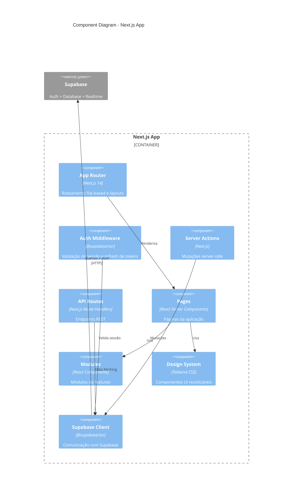
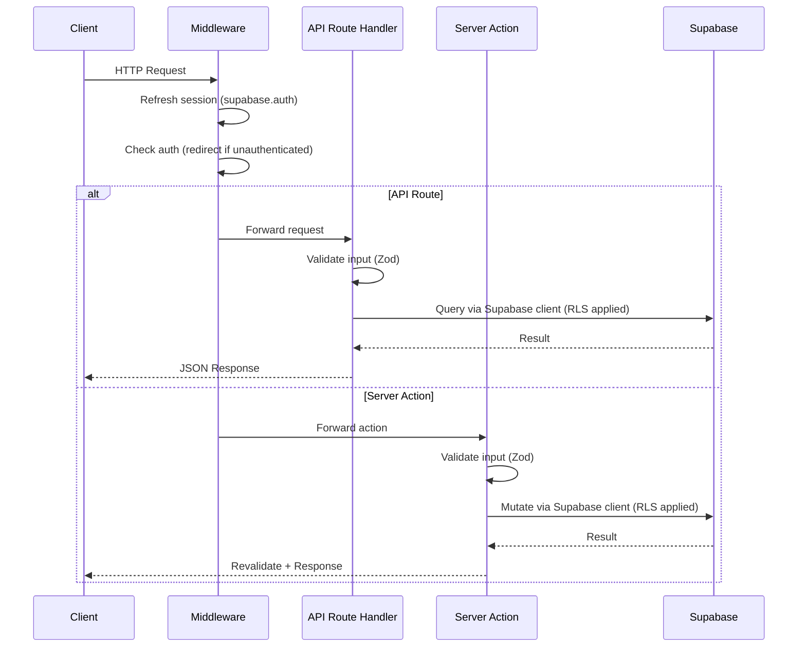

# C4 Model - Nível 3: Component Diagram

> Visão dos componentes internos dos principais containers.

## Next.js App - Components



### Estrutura de Componentes

```
apps/web/
├── app/                        # App Router (Next.js 14)
│   ├── (auth)/                 # Rotas de autenticação
│   │   ├── login/page.tsx
│   │   └── register/page.tsx
│   ├── (dashboard)/            # Rotas protegidas
│   │   ├── layout.tsx
│   │   └── ...pages
│   ├── api/                    # API Route Handlers
│   │   ├── health/route.ts
│   │   └── ...
│   ├── actions/                # Server Actions
│   ├── layout.tsx              # Root layout
│   └── page.tsx                # Landing page
│
├── components/                  # Componentes da app
│   ├── layout/                 # Header, Sidebar, Footer
│   ├── ui/                     # Design system components
│   └── forms/                  # Form components
│
├── hooks/                       # Custom hooks
│   ├── useHealthCheck.ts
│   └── ...
│
├── lib/                         # Utilitários
│   ├── supabase/
│   │   ├── client.ts           # Browser client
│   │   ├── server.ts           # Server client
│   │   └── middleware.ts       # Auth middleware helper
│   ├── validations/            # Zod schemas
│   └── utils.ts
│
└── types/                       # TypeScript types
    └── database.ts             # Supabase generated types
```

### Packages Compartilhados

```
packages/
├── shared/src/
│   ├── auth/
│   │   ├── types.ts             # UserRole, AuthUser
│   │   └── index.ts             # Exports
│   │
│   ├── api/
│   │   └── client.ts            # Supabase client helpers
│   │
│   ├── cache/
│   │   └── queryClient.ts       # React Query config
│   │
│   └── utils/
│       ├── logger.ts            # Structured logging
│       ├── formatters.ts        # Date, currency, etc.
│       └── helpers.ts           # Utilidades gerais
│
├── design-system/src/
│   ├── components/
│   │   ├── Button/
│   │   ├── Input/
│   │   ├── Modal/
│   │   ├── Card/
│   │   ├── Table/
│   │   └── ...
│   │
│   ├── tokens/
│   │   └── colors.ts, spacing.ts, typography.ts
│   │
│   └── styles/
│       └── base.css
│
└── types/src/
    ├── api.ts                   # API response types
    ├── auth.ts                  # Auth types
    └── common.ts                # Generic types
```

---

## Fluxo de Request (API Routes)



---

## Decisões de Design

### Frontend / Full-stack

| Decisão                   | Razão                                  |
| ------------------------- | -------------------------------------- |
| Next.js App Router        | SSR, RSC, layouts aninhados, streaming |
| Supabase Auth             | Auth integrada com RLS, zero server    |
| Server Actions            | Mutações tipadas, sem API boilerplate  |
| TanStack Query para cache | Cache automático, refetch, mutations   |
| Tailwind + Design Tokens  | Consistência, customização fácil       |
| Zod para validação        | Runtime + compile-time type safety     |

### Database / Auth

| Decisão               | Razão                                     |
| --------------------- | ----------------------------------------- |
| Supabase (PostgreSQL) | Managed, RLS nativo, realtime, storage    |
| Row-Level Security    | Multi-tenancy seguro sem middleware       |
| JWT via Supabase      | Stateless, auto-refresh via @supabase/ssr |

---

**Referências:**

- [C4 Model](https://c4model.com/)
- [Mermaid C4](https://mermaid.js.org/syntax/c4.html)
