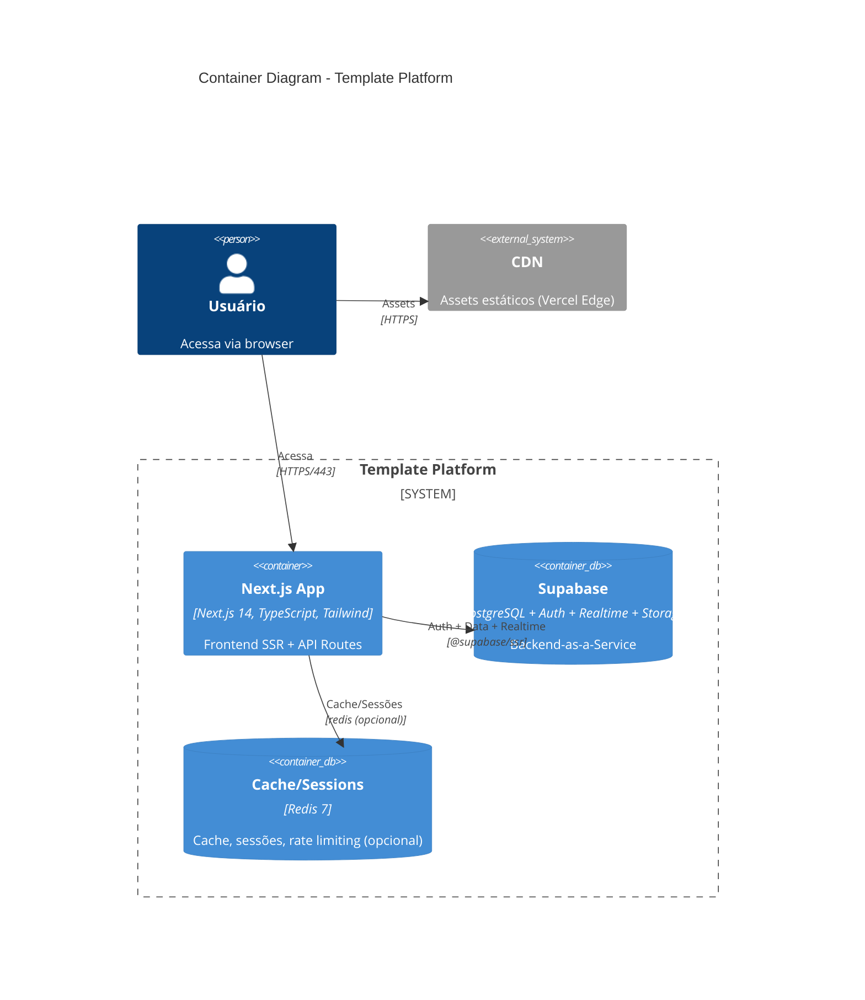

# C4 Model - Nível 2: Container Diagram

> Visão dos containers (unidades deployáveis) do Template Platform.

## Diagrama de Containers



## Containers

### Next.js App

| Atributo         | Valor                                      |
| ---------------- | ------------------------------------------ |
| **Tecnologia**   | Next.js 14, TypeScript 5.x, Tailwind CSS 3 |
| **Localização**  | `apps/web/`                                |
| **Build output** | `.next/`                                   |
| **Porta (dev)**  | 3000                                       |
| **Porta (prod)** | 443 (Vercel)                               |

**Responsabilidades:**

- Interface de usuário com SSR/SSG
- API Routes (server-side)
- Autenticação via Supabase Auth (`@supabase/ssr`)
- Server Actions para mutações
- Design System compartilhado (Tailwind)

**Dependências de runtime:**

```
@supabase/supabase-js ^2.x
@supabase/ssr ^0.x
@tanstack/react-query ^5.x
tailwindcss ^3.x
zod ^3.x
```

### Supabase (Backend-as-a-Service)

| Atributo       | Valor                             |
| -------------- | --------------------------------- |
| **Tecnologia** | PostgreSQL 15 + GoTrue + Realtime |
| **Auth**       | Supabase Auth (JWT RS256)         |
| **Database**   | PostgreSQL com RLS                |
| **Realtime**   | WebSocket subscriptions           |
| **Storage**    | S3-compatible object storage      |

**Responsabilidades:**

- Autenticação e autorização (JWT + RLS)
- Persistência de dados (PostgreSQL)
- Row-Level Security para multi-tenancy
- Realtime subscriptions
- File storage

**Schema gerenciado por:**

- Supabase migrations (`supabase/migrations/`)
- TypeScript types gerados via `supabase gen types`

### Cache/Sessions (Redis) — Opcional

| Atributo         | Valor            |
| ---------------- | ---------------- |
| **Tecnologia**   | Redis 7 Alpine   |
| **Porta**        | 6379             |
| **Persistência** | AOF (appendonly) |

**Usos:**

- Cache de queries (opcional)
- Rate limiting storage
- Sessões distribuídas (se necessário)

## Comunicação entre Containers

### Next.js → Supabase

```
Protocolo: HTTPS (supabase-js client)
Autenticação: JWT gerenciado pelo @supabase/ssr
Headers automáticos:
  - Authorization: Bearer <access_token>
  - apikey: <anon_key>
```

### Next.js → Redis (opcional)

```
Protocolo: TCP (ioredis)
Connection string: redis://host:6379
SSL: opcional
```

## Deploy Configurations

### Desenvolvimento Local

```yaml
services:
  web: localhost:3000 # Next.js dev server
  supabase: localhost:54321 # Supabase local (CLI)
  db: localhost:54322 # PostgreSQL (via Supabase)
  redis: localhost:6379 # Redis (opcional)
```

### Produção (Vercel + Supabase Cloud)

```yaml
Deployments:
  - Next.js App → Vercel (auto-scaling)
  - Supabase → Supabase Cloud (managed)
Domains:
  - app.domain.com → Vercel
  - *.supabase.co → Supabase Cloud
```

---

**Próximo nível:** [C4 Component Diagram](./c4-component.md)
