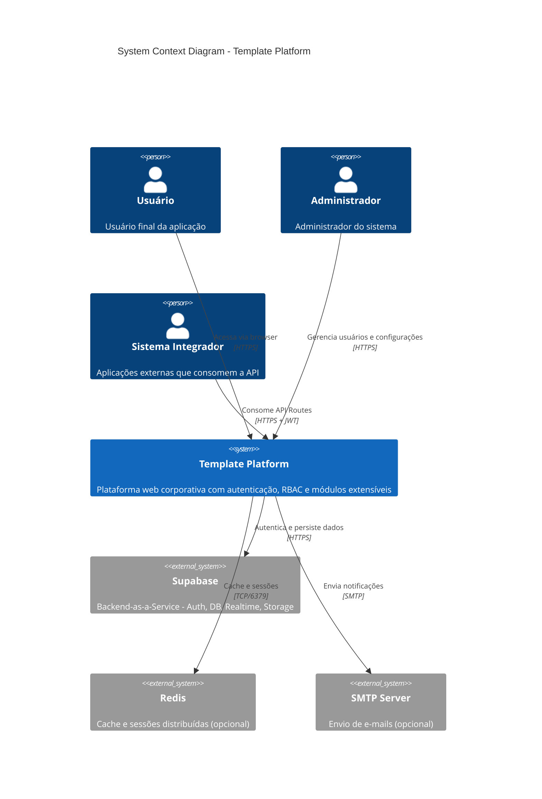
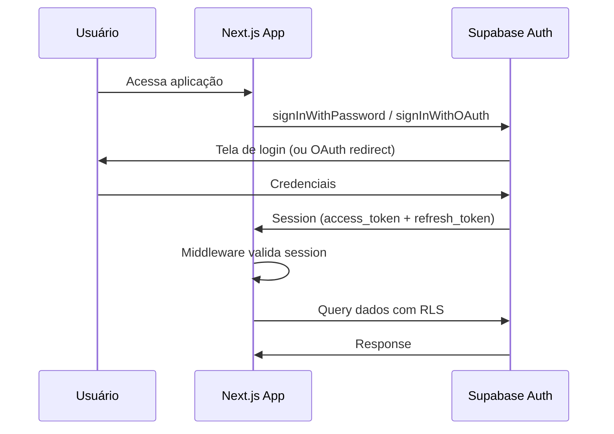
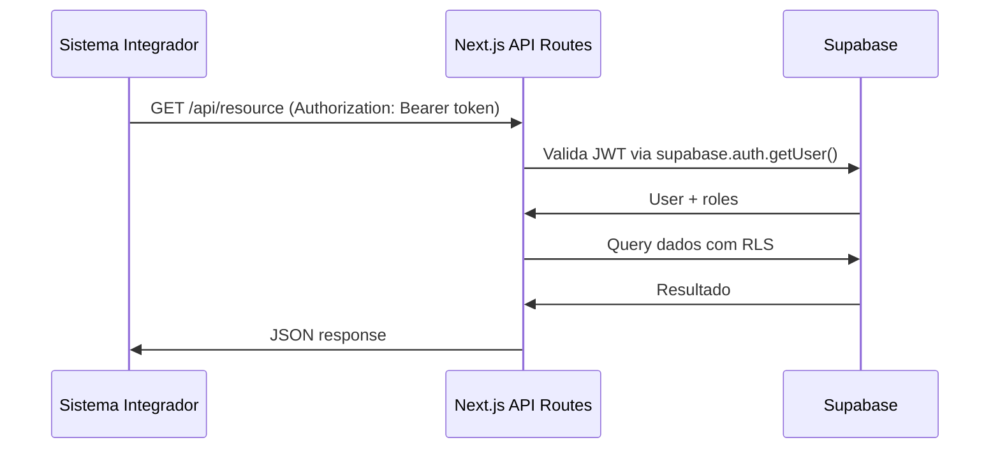

# C4 Model - Nível 1: Context Diagram

> Visão de alto nível do sistema Template Platform e suas interações externas.

## Diagrama de Contexto

## Descrição dos Elementos

### Atores

| Ator                   | Descrição                                     | Interação                |
| ---------------------- | --------------------------------------------- | ------------------------ |
| **Usuário**            | Usuário final que acessa a aplicação web      | Browser via HTTPS        |
| **Administrador**      | Gerencia configurações, usuários e permissões | Browser via HTTPS        |
| **Sistema Integrador** | Aplicações externas que consomem a API        | REST API via HTTPS + JWT |

### Sistema Principal

| Sistema               | Descrição                                                                           | Tecnologia            |
| --------------------- | ----------------------------------------------------------------------------------- | --------------------- |
| **Template Platform** | Plataforma web corporativa com autenticação, RBAC, módulos extensíveis e API Routes | Next.js 14 + Supabase |

### Sistemas Externos

| Sistema      | Propósito                         | Protocolo        | Obrigatório |
| ------------ | --------------------------------- | ---------------- | ----------- |
| **Supabase** | Auth, Database, Realtime, Storage | HTTPS            | Sim         |
| **Redis**    | Cache, sessões, rate limiting     | TCP (porta 6379) | Opcional    |
| **SMTP**     | Notificações por e-mail           | SMTP (porta 587) | Opcional    |

## Fluxos Principais

### 1. Autenticação de Usuário

### 2. Integração Externa (API)

## Limites do Sistema

### Dentro do Escopo (Template Platform)

- Next.js App (SSR + API Routes)
- Autenticação via Supabase Auth
- Autorização RBAC via RLS
- Módulos de negócio
- Design System (Tailwind)
- Testes E2E

### Fora do Escopo (Sistemas Externos)

- Supabase (Auth, Database, Realtime, Storage) - plataforma gerenciada
- Redis - cache distribuído (opcional)
- Infraestrutura de rede/DNS
- CDN para assets estáticos

---

**Próximo nível:** [C4 Container Diagram](./c4-container.md)
